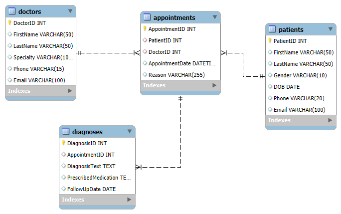

# Healthcare Relational Database System

This is my Healthcare Relational Database System Project —  used to explore healthcare datasets through data cleaning, analysis, visualization, and modeling. The goal is to extract actionable insights that can support decision-making in healthcare contexts.


# Dataset


The datasets used are synthetic/mock data that is simulated to represent a typical hospital or clinic system.  These files are included as .csv files.


# Project Structure/Database Schema

Table Structure

Patients: Stores personal info about patients

Doctors: Stores doctor details and specialties

Appointments: Manages scheduled consultations

Diagnoses: Records post-appointment medical observations and treatment


# Relationships:

Entity and	Relationship/Cardinality

Patients → Appointments - One-to-Many - One patient can have many appointments

Doctors → Appointments - One-to-Many - One doctor can have many appointments

Appointments → Diagnoses - One-to-One or One-to-Many - One appointment can have one or more diagnoses

ERD Diagram:
--------------

This diagram visualizes the structure and relationships between tables in the healthcare database schema.




# Data Import
Loads CSV files into MySQL using LOAD DATA INFILE

patients.csv

doctors.csv

appointments.csv

diagnoses.csv


# Queries Included
Patient filtering: Find patients born after a specific date

Appointment joins: Display upcoming appointments with doctor and patient info

Doctor stats: Count of doctors by specialty

### Example SQL Query
```sql
-- Filter patients born after 1990
SELECT * FROM Patients WHERE DOB > "1990-07-01";

-- Upcoming appointments with patient and doctor details
SELECT a.AppointmentID, a.AppointmentDate, 
       p.FirstName AS PatientFirstName, d.FirstName AS DoctorFirstName
FROM Appointments a
JOIN Patients p ON a.PatientID = p.PatientID
JOIN Doctors d ON a.DoctorID = d.DoctorID
WHERE a.AppointmentDate >= NOW()
ORDER BY a.AppointmentDate;

-- Number of doctors by specialty
SELECT Specialty, COUNT(*) AS NumDoctors
FROM Doctors
GROUP BY Specialty
ORDER BY NumDoctors DESC;
```

# Requirements

MySQL Server (8.0 or later)

MySQL Workbench or any SQL client

Ensure the following for file loading:

secure_file_priv is set correctly

Your MySQL user has FILE privileges

